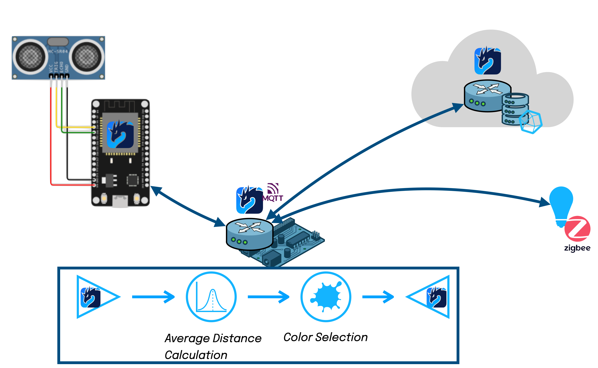

# Zenoh + Zenoh-Flow demo for DevConf.cz



This demo shows a Cloud-to-Thing applicaiton that collects data from a microcontroller-powered sensor,
does some processing at the edge to do some local actuation (turn on a lightbulb) and stores some historical data in the cloud.

In this demo you will see Zenoh and Zenoh-Flow interacting with 3rd party technologies such as MQTT, Zigbee and InfluxDB

## How to run the demo.

Here a step by step guide on reproducing the demo.
## Microcontroller

For the microcontroller part an Espressif ESP32 + Adafruit Ultrasonic Range sensors are needed.

Connect the Ultrasonic sensor SIG pin with the Espressif ESP32 pin 17.
Connect the Ultrasonic VCC and GND to 5V and GND on the  Espressif ESP32.

### Start a Zenoh router

Go to the `zenohd` directoy and start the `docker-compose.yml`

```bash
cd zenohd
docker compose up -d
```

### Create the Zenoh-Pico sensor

Create new folder, ask platformio to create the boilerplate, and add the dependencies


```bash
mkdir ultrasonic
cd ultrasonic
platformio init -b az-delivery-devkit-v4
echo "lib_deps = https://github.com/eclipse-zenoh/zenoh-pico#0.7.0-rc" >> platformio.ini
pio lib install seeed-studio/Grove\ Ultrasonic\ Ranger
```

Then create the `main.ino` file: `touch src/main.ino`.

Copy the content from `sensor/src/main.ino` into your `src/main.ino`,
update the `SSID`, `PASS` and `PEER` constant to match your environment,
then build and flash the board with `pio run -t upload`.

Once the flash is done the board will restart and will publish data in `demo/devconf/ultrasonic`.

You can see the data being published by running `python3 -m client -e tcp/localhost:7447 z_sub_le.py -k "demo/devconf/ultrasonic"`

